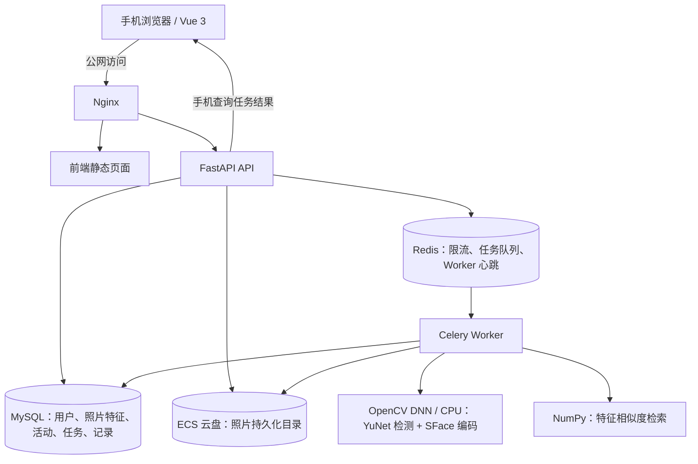

# 南京大学 2026 云计算课程大作业：人脸签到系统简要设计

> 第一迭代设计文档。采用在华为云 ECS 上运行预训练神经网络的方案，显式实现人脸检测、编码和检索。后续实现与验证状态见 [迭代三说明](iteration-three.md)，本文中的性能目标不代表实测结果。

## 1. 需求与资源约束

手机端支持注册、登录、退出登录、拍照上传；用户注册时填写基本信息并上传标准照片。签到无需登录，服务器根据照片在人员库中检索身份、写入签到记录并反馈。照片库管理和签到记录查看需要登录，并校验访问权限。

已知资源：华为云 ECS 为 4 核 CPU、16 GB 内存，无 GPU；人员最多 10 人；所有华为云服务预算不超过 40 元。复用现有 ECS，本机部署数据库和任务队列，不额外购买 GPU、RDS 或托管 Redis。照片保存在 ECS 云盘持久化目录，OBS 作为预算允许时的可选存储扩展。

用户提供的 FRS 每月 2,000 次免费额度可用于课程实验对照，但最终签到主流程不依赖 FRS，不设置自动云 API 回退。ECS、云盘、公网 IP 和流量等费用仍需按现有资源的账单核算。

## 2. 总体架构

| 模块 | 技术选择 | 职责 |
| --- | --- | --- |
| 手机端 | Vue 3 + TypeScript + Vant | 注册、拍照/选图、任务反馈、照片及记录管理 |
| API | FastAPI + SQLAlchemy + Alembic | 鉴权、上传、业务接口、数据库迁移 |
| 视觉推理 | OpenCV DNN，CPU 后端 | 加载预训练 ONNX 模型，检测、对齐和编码 |
| 身份检索 | NumPy 余弦相似度 | 在最多 10 人的已录入特征中检索 |
| 异步处理 | Celery + Redis，本机部署 | 将模型推理与请求接收分开，缓冲集中上传 |
| 数据与部署 | MySQL 8 + 持久卷 + Docker Compose | 数据持久化、服务启停与恢复 |

第一版所有服务运行在同一台 ECS。手机通过 EIP 访问入口；正式登录与实时摄像头使用需要安排可信 HTTPS。手机端先提供拍照/选图上传入口，不能假设公网 HTTP IP 可以使用 `getUserMedia`；相机行为在验收手机上验证。

本地开发与快速自动化测试允许使用 SQLite；Compose 集成环境使用 MySQL 和 Redis。通过 Alembic 迁移管理数据库结构，生产环境不在 API 启动时自动建表。第二次迭代只保存账号、照片和上传任务，照片状态为 `uploaded`，不作为可参与识别的 `ready` 模板；第三次再接入推理 Worker。

## 3. 模型选择

### 3.1 人脸检测：YuNet

YuNet 是轻量级人脸检测神经网络，输出人脸框和五个人脸关键点，适合作为 CPU 部署的候选。建议先固定 OpenCV 4.x 与 `face_detection_yunet_2023mar.onnx` 组合，验证兼容性后锁定依赖版本和模型校验值。

检测阶段拒绝无人脸和多张人脸，结合脸部尺寸、清晰度等检查提示重新拍照；使用关键点为后续识别进行对齐。

### 3.2 人脸编码：SFace

采用 OpenCV Zoo 提供的 SFace 预训练识别模型，初选 `face_recognition_sface_2021dec.onnx`。该模型使用 MobileFaceNet 网络及 SFace 损失函数训练，支持五点对齐后的特征提取。应用通过 OpenCV 的 `FaceRecognizerSF` 完成对齐裁剪与编码，将输出特征归一化后保存。

YuNet 与 SFace 均为神经网络模型。项目使用已有预训练权重做推理，不需要从零训练，也不需要 GPU。4 核 16 GB 配置可作为这组轻量模型的部署起点，实际延迟、内存和并行度必须在 ECS 上测量。

### 3.3 匹配方法与版本管理

设归一化签到向量为 q、标准照向量为 e，余弦相似度为 `s = q · e`。注册时预先计算标准照编码；签到时只计算一次上传照片的编码，再与最多 10 个模板进行矩阵运算，不逐人重复运行神经网络。

系统保存模型标识、版本、特征维度和照片版本。模型升级后重新编码全库并重新校准阈值，不混用不同模型空间的向量。

最高相似度达到阈值，且与第二候选用户差距足够时才接受；只有一个候选时只使用相似度阈值。阈值通过项目内真实照片校准，测试不同角度、光照以及未录入人员，不直接把示例阈值或公开数据集准确率当作本项目效果。

官方模型资料：

- YuNet：https://github.com/opencv/opencv_zoo/tree/main/models/face_detection_yunet
- SFace：https://github.com/opencv/opencv_zoo/tree/main/models/face_recognition_sface

已查看上述模型说明：YuNet 目录标注 MIT 许可，SFace 目录标注 Apache 2.0 许可；交付时保留所用版本的许可和来源信息。

## 4. 核心业务流程

### 注册与照片管理

填写姓名、学号/工号、账号密码 → 上传标准照 → 本地校验图片 → YuNet 单脸检测 → 关键点对齐 → SFace 编码 → 保存照片和特征 → 标记录入成功。

照片状态包括 `pending`、`ready`、`rejected`，只有 `ready` 的模板参加检索。第一版每人一张有效标准照；换照先验证新照片，再事务性替换有效模板。删除或停用照片后，对应特征不得继续参与签到。

### 匿名签到

选择活动 → 拍照上传 → 创建任务 → 单脸检测、对齐与编码 → 检索有效特征库 → 阈值及候选差距判断 → 检查活动与账号状态 → 幂等写入签到记录 → 手机显示结果。

客户端仅提供活动 ID、照片和请求幂等键，不通过账号、设备或提交的 user_id 决定身份。活动链接或二维码只定位活动。

必须区分：签到成功、已签到、未识别到登记人员、无人脸、多张人脸、图片不合格、系统处理失败。不得将最高分候选无条件当作上传者，不得把模型执行失败显示成未录入人员。

### 权限

访客可以注册、登录和签到；普通用户登录后只能管理自己的照片并查看自己的记录；管理员可管理人员、活动和活动签到记录。注销按退出登录实现，不删除账号。所有权限在服务端验证。

## 5. 数据与接口

| 数据表 | 主要内容 |
| --- | --- |
| users | 学号/工号、姓名、登录名、密码哈希、角色、状态 |
| face_templates | user_id、照片存储引用、特征向量、模型版本、照片版本、状态 |
| attendance_events | 名称、起止时间、状态、创建者 |
| attendance_records | event_id、user_id、服务端时间、相似度、source_job_id |
| recognition_jobs | 类型、状态、图片引用、幂等键、结果码、创建及完成时间 |

学号/工号和登录名设唯一约束；`attendance_records(event_id, user_id)` 联合唯一约束保证同一活动每人一条签到记录。日期时间以服务器为准，存储 UTC、界面显示北京时间；按服务器接收上传时间判断签到窗口，写入时再次检查活动是否取消和用户是否停用。

照片库规模很小，Worker 每次任务直接从数据库读取有效特征，无需额外维护内存向量索引；最终写入时校验匹配模板版本和状态。图片文件与数据库无法共用事务，通过待处理状态、失败补偿和孤立文件清理保证一致性。

主要接口包括注册、登录、退出登录、个人资料、照片上传/删除、匿名签到提交、任务查询、本人记录查询，以及管理员人员/活动/记录管理。任务提交返回 `202 Accepted`；匿名查询通过不可预测任务标识及短期凭证授权，只返回本次必要结果。

## 6. 集中签到与可靠性

- API 完成文件校验和任务持久化后立即返回，由 Worker 执行模型推理，防止推理阻塞普通页面请求。
- 模型在 Worker 进程启动时加载一次；先用一个推理进程，在 4 核 CPU 上限制 OpenCV 线程数，压测后再调整进程数与线程数。
- 前端压缩图片，后端独立限制文件大小、像素、格式及可解码性；队列传图片引用，不传整张 Base64。
- 队列设置容量和等待超时；满载时返回 429/503。客户端约 1–2 秒查询任务并逐步退避，展示处理中状态。
- 请求幂等键防止网络重发创建重复任务；数据库唯一约束防止重复签到。Worker 重试仍需检查任务完成状态；补偿扫描恢复漏投递及卡住的任务。
- 权限、队列和图片限制同时作用于匿名入口，考虑多人共用校园 NAT，避免仅靠过低的每 IP 配额限流。

队列只能缓冲突发，不能提高 CPU 的实际推理能力。验证时记录机器规格、模型版本、输入尺寸、API 接收耗时、排队时间、完整任务 p95、成功率及 CPU/内存占用。依次测试 1、5、10 个并发请求；更大突发用于验证排队和过载行为，不提前承诺吞吐量。

## 7. 部署、预算与数据保护

复用现有 ECS，不产生按次 FRS 识别费用；MySQL、Redis 和照片均本机持久化。是否能够满足全部云费用 40 元，需要核对现有资源付款情况、公网流量和云盘费用；关机不代表所有关联资源停止计费。OBS 可选，不作为第一版必要依赖。

数据库和 Redis 不开放公网端口；照片不放公开静态目录；密码使用 Argon2id 等密码哈希。会话使用 HttpOnly、Secure、SameSite Cookie，并设置 CSRF 防护。标准照片与特征均按敏感数据管理，告知用途、保留期限与删除方式；签到临时图片短期保存后清理，日志不写照片或完整特征。

第二次迭代将可撤销会话持久化在数据库，Redis 用于跨 API 进程限流并预留第三次迭代任务队列。临时匿名上传在 24 小时后过期，由清理命令删除图片和任务；本人标准照片可登录后删除。照片用途与保留政策在注册时确认。

部署锁定 OpenCV 与模型版本，将模型文件存于持久目录，避免每次开机下载；模型加载成功后才报告 Worker 就绪。设置容器重启策略、数据库备份和恢复流程。

第一版不包含活体检测，不能宣称防止照片或视频代签；如验收增加此要求，再单独设计与验证。

## 8. 三次迭代与验收

| 迭代 | 工作内容 | 提交材料 |
| --- | --- | --- |
| 第一次 | 明确架构、YuNet/SFace 模型、编码与检索流程、数据和并发策略 | 简要设计文档 |
| 第二次 | 手机端与 API 框架、注册、登录、退出登录、照片管理和拍照上传；尽早在 ECS 验证单图检测与编码 | 手机页面与数据库变化截图 |
| 第三次 | 完成特征入库、匿名检索、拒识、幂等签到、记录查询及并发验证 | 完整手机流程、服务器日志/数据库截图、简要压测结果 |

第二次如果模型尚未接入，只显示已上传/待处理，不伪造录入成功。第三次重点演示新用户注册并生成特征、已录入人员无需登录签到、未录入人员拒识；补充重复签到、无脸/多脸提示及登录查看记录。

服务器证据展示模型版本、检测数量、特征维度、匹配结果和签到记录变化，不公开完整特征或未脱敏个人信息。验收前检查 ECS 开机、公网入口、模型加载、数据库连接和持久化数据。
